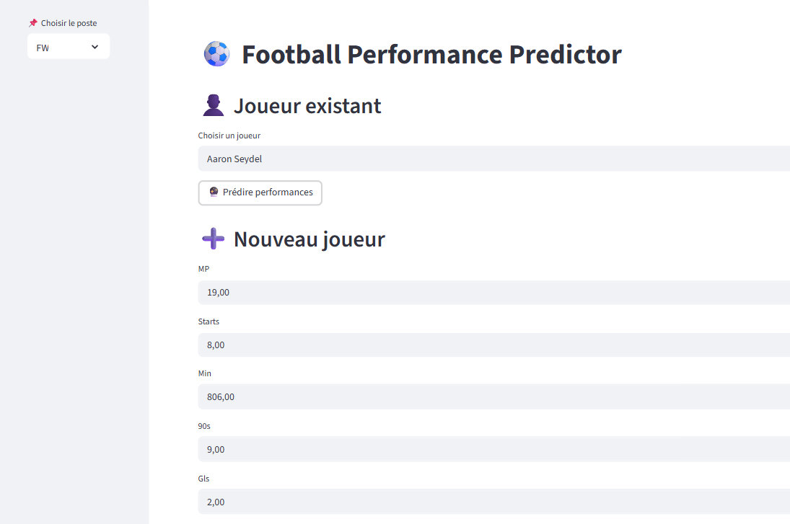
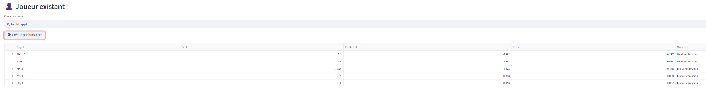
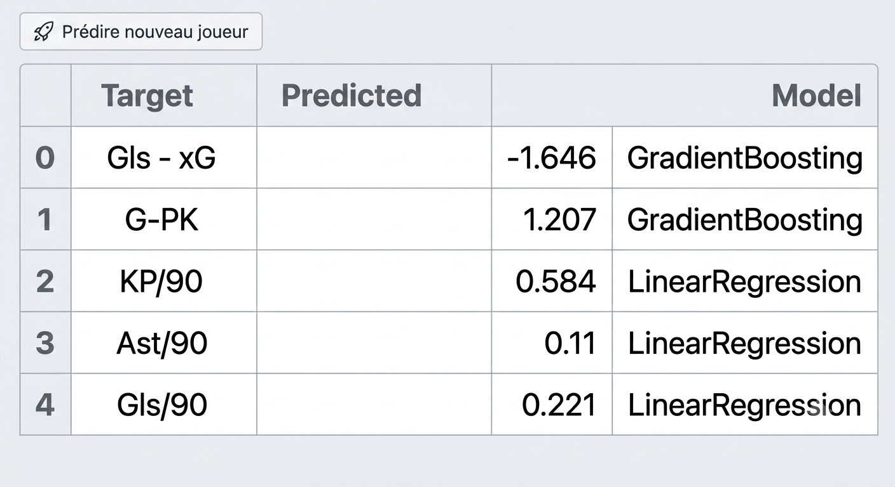
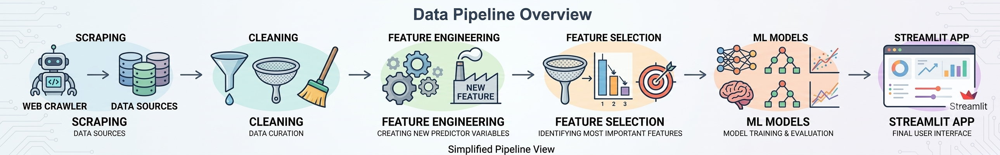

# Football Performance Predictor

## Project Date

**December 2025**

## Overview

This project presents a Machine Learning pipeline and a Streamlit application for predicting football player performance by position. The system focuses on three main roles: forwards, midfielders and defenders.

The project includes data scraping, data cleaning, feature engineering, feature selection, model training and deployment through an interactive Streamlit interface.

## Project Context

Football performance analysis is increasingly driven by data. Clubs, analysts and scouts use player statistics to evaluate player profiles, compare performances and anticipate future contributions.

This project investigates the following question:

> Can Machine Learning models predict key football performance indicators based on historical player statistics?

## Dataset

The dataset contains football player statistics collected across multiple seasons.

The project includes:

- Raw scraped player statistics
- Cleaned multi-season dataset
- Position-specific datasets
- Engineered features
- Selected features for prediction
- Trained models for each position and target variable

## Player Positions

The project builds separate prediction pipelines for each player position.

| Position | Meaning |
|---|---|
| FW | Forward |
| MF | Midfielder |
| DF | Defender |

## Prediction Targets

### Forwards

The application predicts:

- `Gls - xG`
- `G-PK`
- `KP/90`
- `Ast/90`
- `Gls/90`

### Midfielders

The application predicts:

- `Total Cmp%`
- `PrgC/90`
- `PrgP/90`
- `Chllngs Lost/90`
- `KP/90`

### Defenders

The application predicts:

- `Tkl/90`
- `Int/90`
- `Blocks/90`
- `Clr/90`
- `Gls/90`

## Methodology

The project follows a complete Machine Learning workflow.

### 1. Data Scraping

Football player statistics were collected using a custom scraping pipeline.

### 2. Data Cleaning

The raw dataset was cleaned by removing duplicated columns, standardizing variable names and preparing position-specific datasets.

### 3. Feature Engineering

New features were created separately for forwards, midfielders and defenders in order to better represent position-specific performance.

### 4. Feature Selection

Selected datasets were created for each position to keep the most relevant predictive variables.

### 5. Model Training

Several Machine Learning models were trained separately for each position and each target variable.

### 6. Deployment

A Streamlit application was developed to allow users to interact with the trained models.

The app allows users to:

- Select a player position
- Predict performance for an existing player
- Enter custom statistics for a new player
- Compare real and predicted values
- Display the model used for each target

## Streamlit Application

The application supports two prediction modes.

### Existing Player Prediction

The user selects an existing player from the dataset. The application displays:

- Real value
- Predicted value
- Prediction error
- Model used

### New Player Prediction

The user manually enters player statistics. The application returns predicted performance indicators for the selected position.

## Visual Results

### Streamlit Interface



### Existing Player Prediction



### New Player Prediction



### Project Pipeline



## Project Structure

```text
football-performance-predictor/
│
├── README.md
├── requirements.txt
├── .gitignore
├── app.py
├── main.py
│
├── data/
│   ├── raw/
│   │   └── player_stats_combined_all_years.xlsx
│   ├── cleaned/
│   │   ├── player_stats_cleaned_all_years.xlsx
│   │   ├── FW_players.xlsx
│   │   ├── MF_players.xlsx
│   │   └── DF_players.xlsx
│   ├── features/
│   │   ├── features_FW.xlsx
│   │   ├── features_MF.xlsx
│   │   └── features_DF.xlsx
│   └── selection/
│       ├── features_FW_selected.xlsx
│       ├── features_MF_selected.xlsx
│       └── features_DF_selected.xlsx
│
├── ML_Notebooks/
│   ├── ML_FW.ipynb
│   ├── ML_MF.ipynb
│   ├── ML_DF.ipynb
│   └── best_*.pkl
│
├── models/
│   ├── fw_metrics.pkl
│   └── fw_models.pkl
│
├── scraper/
│   └── PlayersScraper.py
│
├── cleaning/
│   └── clean_players.py
│
├── features_engineering/
│   ├── features_engineering_FW.py
│   ├── features_engineering_MF.py
│   └── features_engineering_DF.py
│
├── features_selection/
│   ├── features_selection_FW.py
│   ├── features_selection_MF.py
│   └── features_selection_DF.py
│
└── images/
    ├── app_interface.png
    ├── existing_player_prediction.png
    ├── new_player_prediction.png
    └── pipeline_overview.png
```

## How to Run

### 1. Clone the repository

```bash
git clone https://github.com/arefbakali/football-performance-predictor.git
cd football-performance-predictor
```

### 2. Create a virtual environment

```bash
python -m venv .venv
```

### 3. Activate the virtual environment

On Windows:

```bash
.venv\Scripts\activate
```

On macOS/Linux:

```bash
source .venv/bin/activate
```

### 4. Install dependencies

```bash
pip install -r requirements.txt
```

### 5. Run the Streamlit application

```bash
streamlit run app.py
```

The application will open in your browser, usually at:

```text
http://localhost:8501
```

## How to Use the App

### Existing Player Mode

1. Select the player position: `FW`, `MF` or `DF`.
2. Choose an existing player from the list.
3. Click the prediction button.
4. The app displays real values, predicted values, prediction errors and the model used.

### New Player Mode

1. Select the player position.
2. Enter the required statistics manually.
3. Click the prediction button.
4. The app displays predicted performance indicators for the new player.

## Requirements

Main libraries used:

- Python
- Streamlit
- Pandas
- OpenPyXL
- Joblib
- Scikit-learn

## requirements.txt

```txt
streamlit>=1.30.0
pandas>=2.0.0
openpyxl>=3.1.0
joblib>=1.3.0
scikit-learn>=1.3.0
```

## Key Takeaways

- The project builds separate models for each football position.
- The prediction targets are adapted to each role: forwards, midfielders and defenders.
- The full pipeline covers scraping, cleaning, feature engineering, feature selection and model deployment.
- Streamlit makes the trained models accessible through an interactive interface.
- The project can support football analytics, player comparison and scouting analysis.

## Limitations

- The model depends on the quality and availability of historical player statistics.
- Predictions are based on statistical patterns and should not replace expert scouting judgment.
- Some player performance factors, such as injuries, tactics, team context and playing time, are not fully captured.
- The scraping pipeline may require updates if the source website structure changes.

## Future Improvements

- Add more seasons and leagues
- Improve model evaluation with detailed metrics
- Add visual player comparison dashboards
- Add SHAP explanations for model predictions
- Deploy the Streamlit application online
- Add automatic data update pipeline
- Add team-level and league-level contextual features

## Author

**Aref Bak Ali**<br>
AI, Data Science & Agentic AI Student<br>
GitHub: https://github.com/arefbakali<br>
LinkedIn: https://linkedin.com/in/aref-bak-ali/